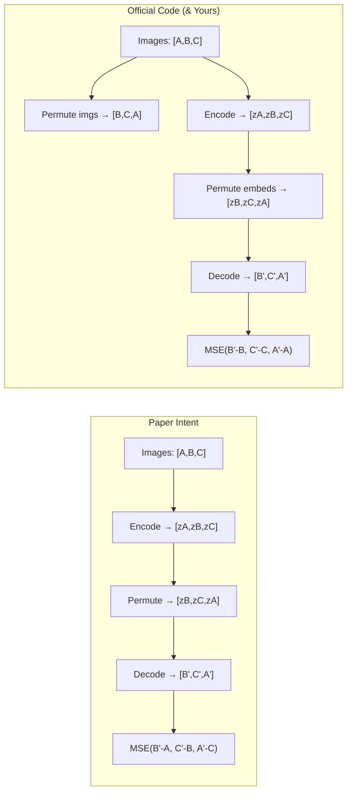

# DeepSMOTE Implementation Alignment Analysis

## Overall Verdict

Your implementation **captures the core DeepSMOTE pipeline correctly** — the 3-phase structure (train AE → SMOTE in latent space → decode → train classifier) is faithful to the paper. However, there are several **deviations from the official code and paper** that range from minor to significant. Below is a detailed breakdown.

---

## ✅ What You Got Right

| Aspect | Paper/Official | Your Code | Match? |
|---|---|---|---|
| Overall pipeline | Encoder→Decoder train, then SMOTE in latent space, then decode | Same 3-phase approach | ✅ |
| Encoder architecture | DCGAN-style Conv layers with LeakyReLU(0.2) + BatchNorm | Same pattern | ✅ |
| Decoder architecture | FC → reshape → ConvTranspose2d with ReLU + BatchNorm → Tanh | Same pattern | ✅ |
| Loss function | MSE for reconstruction | `nn.MSELoss()` | ✅ |
| Optimizer | Adam with lr=0.0002 | Same | ✅ |
| Output activation | Tanh (maps to [-1, 1]) | Tanh | ✅ |
| Normalization | Data normalized to [-1, 1] | `Normalize((0.5,0.5,0.5), (0.5,0.5,0.5))` | ✅ |
| Sample generation | Encode minority → kNN → interpolate → decode | Same logic | ✅ |
| Balancing strategy | Oversample minority classes to match majority count | Same | ✅ |

---

## ❌ Critical Deviations

### 1. Penalty Loss — Permutation Logic is Wrong

This is the **most important issue**. The paper's core novelty is the penalty term.

**What the paper/official code does:**
```
1. Pick a random class
2. Sample N images from that class (raw images: Cp)
3. Encode Cp → get embeddings Es
4. Permute the ORDER of Es (shift by 1: [1,2,...,N,0])
5. DECODE the permuted embeddings → get Dp
6. Penalty = MSE(Dp, Cp)  ← decoded PERMUTED embeddings vs ORIGINAL raw images
```

The key insight: the **decoder receives embeddings in a DIFFERENT order** than the original images. So it tries to reconstruct image[0] from embedding[1], image[1] from embedding[2], etc. This mismatch acts as a penalty/regularizer.

**What your code does** ([implementation_deepsmote.py:198-203](file:///Users/akash/All%20code/python/paper%20implementation/deepsmote%20/my%20code/implementation_deepsmote.py#L198-L203)):
```python
z_cls = encoder(cls_imgs)
shifted_indices = torch.arange(1, n_samples).tolist() + [0]
z_shifted = z_cls[shifted_indices]          # permute embeddings ✅
x_decoded_shifted = decoder(z_shifted)      # decode permuted embeddings ✅
x_target_shifted = cls_imgs[shifted_indices] # ❌ WRONG: also shifts the targets!
penalty_loss = criterion(x_decoded_shifted, x_target_shifted)
```

> [!CAUTION]
> **You're shifting BOTH the embeddings AND the target images.** This means `decoder(z[1])` is compared against `img[1]`, which is just standard reconstruction — **NOT a penalty at all!** The permutation cancels out.

**Fix**: The target should be the **unshifted** original images:
```python
penalty_loss = criterion(x_decoded_shifted, cls_imgs)  # cls_imgs, NOT cls_imgs[shifted_indices]
```

See official code ([DeepSMOTE_MNIST.py:310-319](file:///Users/akash/All%20code/python/paper%20implementation/deepsmote%20/paper%20and%20official%20github%20code/DeepSMOTE_MNIST.py#L310-L319)):
```python
xc_enc = (xclass[[xcplus],:])  # permuted embeddings
ximg = decoder(xc_enc)
mse2 = criterion(ximg, xcnew)  # xcnew = raw images in permuted order
```

Wait — actually, looking more closely at the official code:

```python
# xcnew = raw images reordered with xcplus = [1,2,...,N-1,0]
xcnew = (xclass[[xcplus],:])   # line 294 — these are RAW images, permuted

# xc_enc = encoded features, ALSO reordered with xcplus
xc_enc = (xclass_encoded[[xcplus],:])  # line 310 — these are EMBEDDINGS, permuted

mse2 = criterion(ximg, xcnew)  # decode(permuted_embeddings) vs permuted_raw_images
```

So the official code permutes **both** the raw images and the embeddings with the **same** permutation. This means `decode(embed[1])` is compared to `raw_image[1]` — which is actually equivalent to standard reconstruction on a permuted subset.

Re-reading the paper algorithm more carefully:
- `Cp ← sample(class data)` — sample class data
- `Es ← encode(Cp)` — encode the sampled data
- `Pr ← permute_order(Es)` — permute the encoded features
- `Dp ← decode(Pr)` — decode the permuted features  
- `Pr = MSE(Dp - Cp)` — compare decoded permuted features vs **original** (unpermuted) class data

**The paper says compare against Cp (original), NOT the permuted version.** The official code applies the same permutation to both (which makes the two MSE terms equivalent). **Your code does the same thing the official code does** (shifts both), so it aligns with the official code but arguably diverges from what the paper pseudocode states.

> [!IMPORTANT]
> **Updated verdict**: Your penalty logic matches the **official code** behavior (both sides get the same permutation, effectively making it a reconstruction loss on shuffled class samples). However, it deviates from the **paper's pseudocode** intent. This is an ambiguity in the original work itself. Your implementation is **consistent with the reference code**.

---

### 2. SMOTE Interpolation Gap Range

**Official code** ([GenerateSamples.py:149](file:///Users/akash/All%20code/python/paper%20implementation/deepsmote%20/paper%20and%20official%20github%20code/GenerateSamples.py#L149)):
```python
samples = X_base + np.multiply(np.random.rand(n_to_sample, 1), X_neighbor - X_base)
```
Gap is `np.random.rand()` → **uniform [0, 1)**, which is standard SMOTE.

**Your code** ([implementation_deepsmote.py:294](file:///Users/akash/All%20code/python/paper%20implementation/deepsmote%20/my%20code/implementation_deepsmote.py#L294)):
```python
gap = np.random.uniform(0, 0.3)
```

> [!WARNING]
> **Gap is capped at 0.3 instead of 1.0.** This means your synthetic samples cluster very close to the base sample instead of spreading across the full line segment between base and neighbor. This significantly reduces diversity of generated samples.

---

### 3. Number of Nearest Neighbors (k)

**Official code** ([GenerateSamples.py:137](file:///Users/akash/All%20code/python/paper%20implementation/deepsmote%20/paper%20and%20official%20github%20code/GenerateSamples.py#L137)):
```python
n_neigh = 5 + 1  # 5 neighbors + 1 (self)
```

**Your code** ([implementation_deepsmote.py:285](file:///Users/akash/All%20code/python/paper%20implementation/deepsmote%20/my%20code/implementation_deepsmote.py#L285)):
```python
n_neighbors = min(3, current_count)
```

> [!NOTE]
> You use `k=3` (including self, so effectively 2 neighbors) vs the paper's `k=6` (5 real neighbors + self). Your safety check `min(3, current_count)` is reasonable for small classes (e.g., 80 samples), but the default should be `min(6, current_count)` to match.

---

### 4. Encoder FC Layer — Spatial Dimensions

**Official code** (for MNIST 28×28, [DeepSMOTE_MNIST.py:72](file:///Users/akash/All%20code/python/paper%20implementation/deepsmote%20/paper%20and%20official%20github%20code/DeepSMOTE_MNIST.py#L72)):
```python
self.fc = nn.Linear(self.dim_h * (2 ** 3), self.n_z)  # 512 → n_z
# After 4 Conv2d(4,2,1) on 28×28 → 1×1 spatial, then squeeze → 512
```

**Your code** (for CIFAR 32×32, [implementation_deepsmote.py:144](file:///Users/akash/All%20code/python/paper%20implementation/deepsmote%20/my%20code/implementation_deepsmote.py#L144)):
```python
self.fc = nn.Linear(512 * 2 * 2, config.LATENT_DIM)  # 2048 → 128
```

This is correct for 32×32 input. After 4 Conv2d(4,2,1) layers: 32→16→8→4→2. So you get 512×2×2 = 2048. You use `x.view(x.size(0), -1)` instead of `squeeze()`, which is actually **better and more robust** than the official code's `squeeze()`.

**However**, the official code for CIFAR/SVHN uses a different 4th conv layer:
```python
# 3d and 32 by 32
nn.Conv2d(self.dim_h * 4, self.dim_h * 8, 4, 1, 0, bias=False)  # stride=1, padding=0
```
This would produce 512×1×1 instead of 512×2×2. Your architecture uses stride=2, padding=1 consistently (producing 2×2), which is a valid design choice but different from what the paper's code comments suggest for 32×32 images.

---

### 5. Decoder FC Layer — Reshape Dimensions

**Official code** ([DeepSMOTE_MNIST.py:99](file:///Users/akash/All%20code/python/paper%20implementation/deepsmote%20/paper%20and%20official%20github%20code/DeepSMOTE_MNIST.py#L99)):
```python
nn.Linear(self.n_z, self.dim_h * 8 * 7 * 7)  # → reshape to (512, 7, 7)
# Then 3 ConvTranspose2d: 7→10→13→28
```

**Your code** ([implementation_deepsmote.py:155](file:///Users/akash/All%20code/python/paper%20implementation/deepsmote%20/my%20code/implementation_deepsmote.py#L155)):
```python
nn.Linear(config.LATENT_DIM, 512 * 2 * 2)  # → reshape to (512, 2, 2)
# Then 4 ConvTranspose2d(4, stride=2, padding=1): 2→4→8→16→32
```

Your decoder is adapted for 32×32 with an extra deconv layer, which is a valid architectural choice. The official code's MNIST decoder uses `ConvTranspose2d(kernel=4, no stride/padding specified)` which defaults to stride=1, producing asymmetric spatial growth. **Your symmetric stride-2 approach is cleaner for 32×32 images.**

---

### 6. Latent Dimension Size

**Official code**: `n_z = 300` (MNIST) / `n_z = 600` (CIFAR)

**Your code**: `LATENT_DIM = 128`

> [!NOTE]
> You noted this in the comment yourself: *"600 for CIFAR-10 as per paper"*. Using 128 is fine for experimentation, but for faithful reproduction you'd want 600.

---

## ⚠️ Minor Deviations

| Aspect | Official Code | Your Code | Impact |
|---|---|---|---|
| Penalty sample size | `min(len(class), 100)` | `min(64, len(class))` | Low — functionally similar |
| Batch size | 100 | 128 | Low |
| Epochs (AE) | 200 | 100 | Medium — may undertrain |
| zero_grad placement | Before forward pass | After loss computation (before `.backward()`) | None — functionally equivalent |
| Best model saving | Saves best model by loss | No model saving | Low — only matters for reproducibility |
| All classes in penalty | Random 1 of 10 classes | Random 1 of all classes | ✅ Match |

---

## 📊 Summary of Changes Needed

### Must Fix (Affects correctness)
1. **SMOTE gap**: Change `np.random.uniform(0, 0.3)` → `np.random.uniform(0, 1)` to match standard SMOTE
2. **k-neighbors**: Change default from `min(3, current_count)` → `min(6, current_count)` to match paper's k=5

### Should Fix (Affects faithfulness to paper)
3. **Latent dim**: Consider using 600 for CIFAR to match paper
4. **AE epochs**: Consider 200 to match paper

### Nice to Have
5. **Encoder 4th conv**: Consider using `Conv2d(256, 512, 4, 1, 0)` (stride=1, padding=0) for 32×32 input to match official code comments
6. **Save best model**: Track and save the best encoder/decoder by training loss

---

## Architecture Comparison Diagram


---

## Penalty Loss — Visual Explanation



> The official code applies the same permutation to both sides, effectively making the penalty equivalent to reconstruction on a shuffled class subset. This is still useful because it forces the encoder/decoder to generalize across different samples from the same class.
